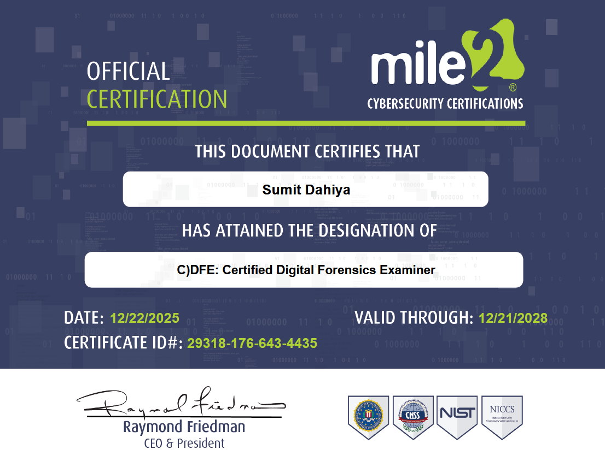
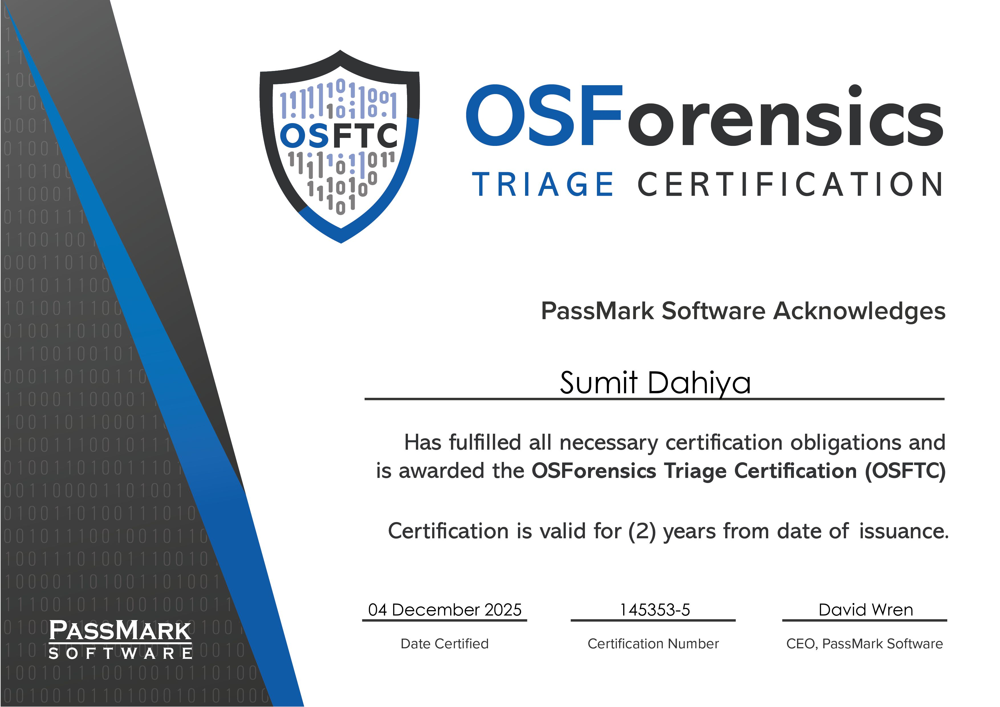
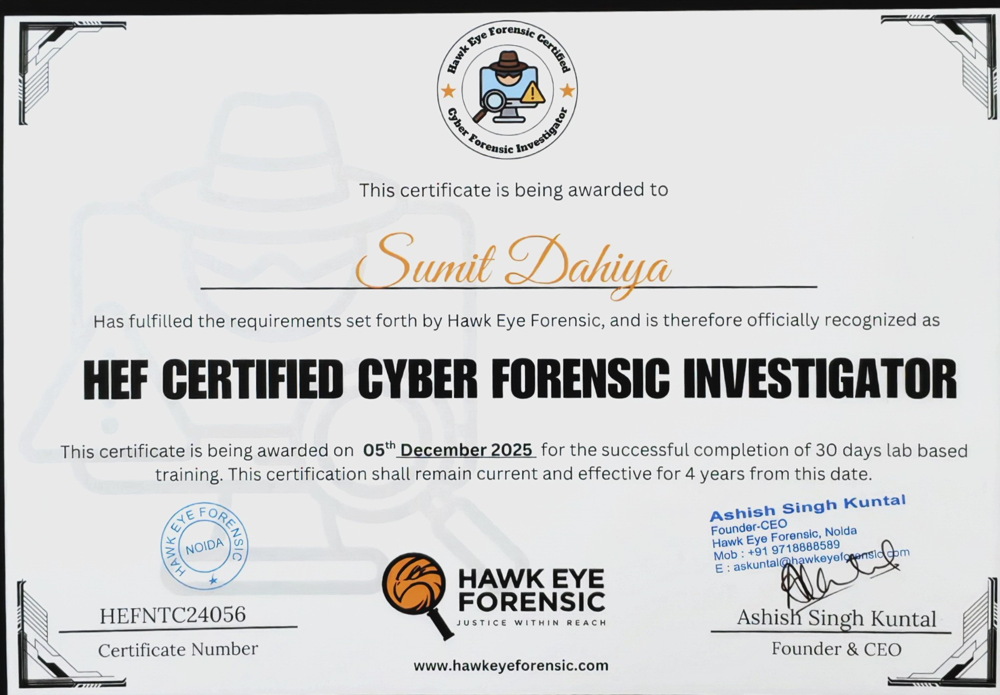
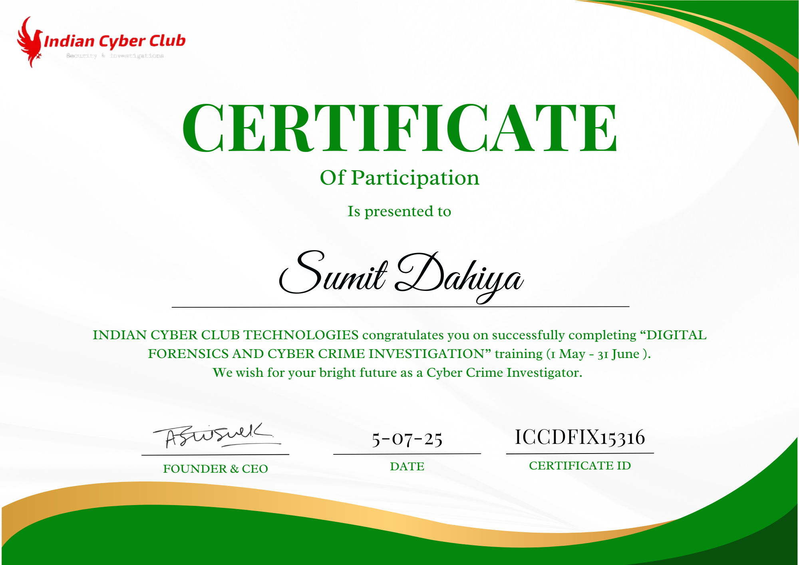
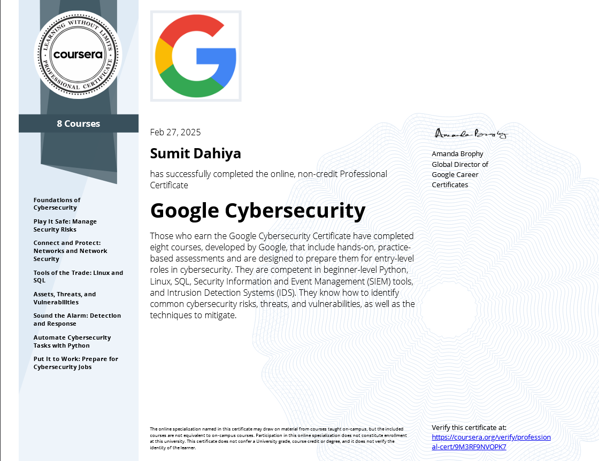
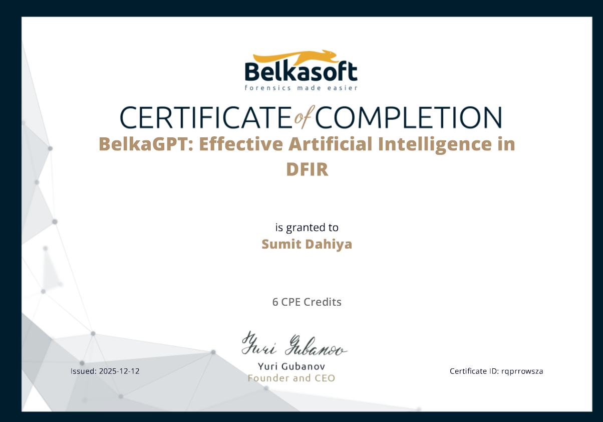

# Professional Credentials & Training

This section documents formal training, certifications, and workshops completed as part of my learning journey in Digital Forensics, DFIR, and Cybercrime Investigation.

These credentials complement the hands-on casework and forensic exercises documented elsewhere in this repository.

---

## Key Certifications

### Certified Digital Forensics Examiner (CDFE)
**Issuing Body:** Mile2  
**Focus Areas:**
- Digital forensic methodology
- Evidence handling and integrity
- File system and artifact analysis
- Legal and ethical considerations in forensic investigations

📄 **Certificate:**  

---

### OSForensics Triage Certification (OSFTC)
**Issuing Body:** PassMark Software  
**Focus Areas:**
- Rapid forensic triage
- Artifact identification
- Live vs dead system awareness
- Initial incident response support

📄 **Certificate:**  

---

### Hawk Eye Forensics – Cyber Forensic Investigator (Training)
**Type:** Lab-based professional training  
**Focus Areas:**
- Computer forensics fundamentals
- Evidence handling
- Case documentation
- Practical forensic exercises

📄 **Certificate:**  

---

### Indian Cyber Club – Digital Forensics & Cyber Crime Investigation
**Type:** Structured training program  
**Focus Areas:**
- Cybercrime investigation process
- Digital evidence basics
- Dark web investigation (workshop)
- Legal awareness

📄 **Certificate:**  

---

### Google Cybersecurity Professional Certificate
**Issuing Body:** Google / Coursera  
**Focus Areas:**
- Cybersecurity fundamentals
- Linux, SQL, SIEM basics
- Incident detection and response concepts

📄 **Certificate:**  

---

### BelkasoftGPT – AI in DFIR (CPE Training)
**Focus Areas:**
- AI-assisted forensic analysis
- Automation awareness in DFIR workflows

📄 **Certificate:**  

---

## Important Note
All certifications listed here support my **practical forensic work**.  
Hands-on exercises, case documentation, and methodology are demonstrated in the main portfolio repositories.
