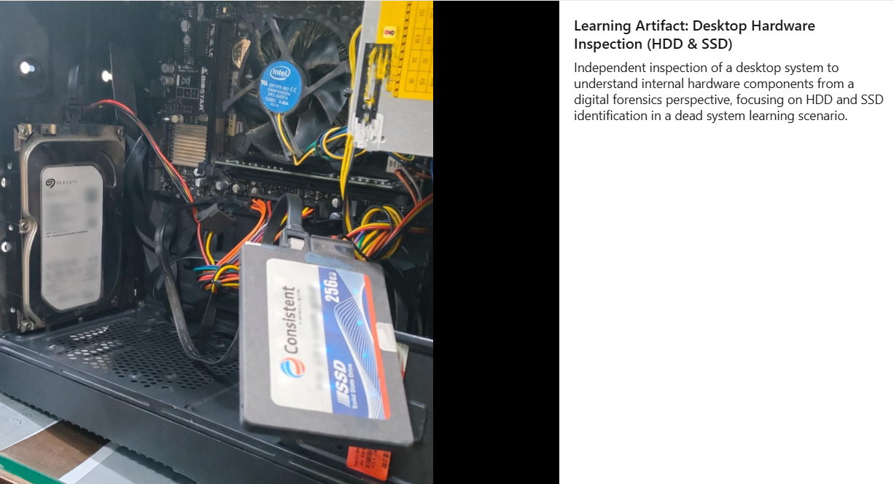

# Desktop Hardware Inspection – Learning Artifact

## Objective
To understand internal desktop hardware components from a digital forensics perspective, with emphasis on identifying storage devices (HDD & SSD) in a non-operational (dead system) learning scenario.

---

**Personal Learning Context:**  
This inspection was performed as part of my personal learning to understand how storage devices are identified prior to forensic acquisition.

---

## Scenario (Learning-Based)
A desktop system was physically inspected to identify:
- Presence and type of storage devices
- Physical placement of HDD and SSD
- Connection interfaces (SATA power & data)
- General internal layout relevant to forensic acquisition planning

This exercise focuses on **pre-acquisition awareness**, not data extraction.

---

## Observations
- One traditional Hard Disk Drive (HDD) identified
- One Solid State Drive (SSD) identified
- SATA power and data cables observed
- Storage devices mounted internally in standard desktop configuration
- **Forensic Note:** No power was applied to the system during inspection to avoid evidence alteration.

---

## Forensic Relevance
- Helps plan evidence acquisition strategy
- Assists in identifying correct imaging approach
- Reduces risk of handling errors during seizure
- Builds hardware familiarity for field investigations

---

## Documentation Notes
- No live system interaction performed
- No data accessed or altered
- No real case or sensitive data involved
- Exercise conducted strictly for educational purposes
- One HDD and one SSD were visually identified during internal inspection

---

## Image Reference

